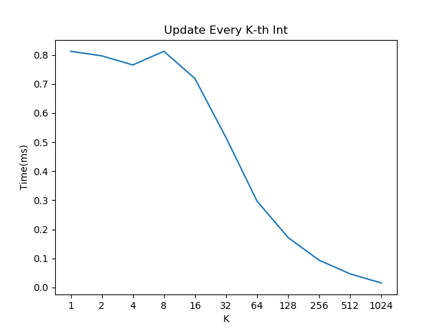

[](https://pubsonline.informs.org/journal/ijoc)

# Combination Chemotherapy Optimization with Discrete Dosing

This repository contains supporting material for the paper Combination Chemotherapy Optimization with Discrete Dosing by Temitayo Ajayi, Seyedmohammadhossein Hosseinian, Andrew J. Schaefer, and Clifton D. Fuller.

This archive is distributed in association with the [INFORMS Journal on Computing](https://pubsonline.informs.org/journal/ijoc) under the [MIT License](LICENSE).

The software and data in this repository are a snapshot of the software and data that were used in the research reported on in the paper.

## Cite

To cite the contents of this repository, please cite both the paper and this repo, using their respective DOIs.

https://doi.org/10.1287/ijoc.2022.0207

https://doi.org/10.1287/ijoc.2022.0207.cd

Below is the BibTex for citing this snapshot of the respoitory.

```
@article{CacheTest,
  author =        {Ajayi, Temitayo and Hosseinian, Seyedmohammadhossein and Schaefer, Andrew J. and Fuller, Clifton D.},
  publisher =     {INFORMS Journal on Computing},
  title =         {Combination Chemotherapy Optimization with Discrete Dosing},
  year =          {2023},
  doi =           {10.1287/ijoc.2022.0207.cd},
  url =           {https://github.com/INFORMSJoC/2022.0207},
}  
```

## Content

The [scripts](scripts) folder contains Python implementation of the models discussed in the paper.

- [Chemo_Deterministic.py](scripts/Chemo_Deterministic.py) Deterministic combination chemotherapy optimization model that employs a discrete linearization technique to approximate bilinear terms.

- [Chemo_Deterministic_McCormick.py](scripts/Chemo_Deterministic_McCormick.py)  Deterministic combination chemotherapy optimization model that employs McCormick envelopes of bilinear terms.

- [Chemo_KillFactors.py](scripts/Chemo_KillFactors.py) Simulation model to estimate kill factor of cytotoxic drugs based on Partial Response Rate (PRR) in clinical trials.

- [Chemo_SensitivityAnalysis.py](scripts/Chemo_SensitivityAnalysis.py) Sensitivity analysis of the deterministic model with respect to kill factor of cytotoxic drugs on tumor cells (*sen_killEffect*), temporal resistance of cytotoxic drugs (*sen_temporalResist*), biological constant of cytotoxic drugs (*sen_bioConstant*), kill factor of cytotoxic drugs on white blood cells (*sen_wbcKill*), maximum daily permissible administration dose for cytotoxic drugs (*sen_maxAdmin*), and minimum permissible level of Neutrophil (*sen_NeutrophilFloor*) parameters. The type of sensitivity analysis is determined through the *sensitivityType* variable, e.g., *sensitivityType* = *sen_NeutrophilFloor*.

- [Chemo_Simulation.py](scripts/Chemo_Simulation.py) Simulation of the regularized (optimal) treatment plan.

- [Chemo_Stochastic.py](scripts/Chemo_Stochastic.py) Stochastic (chance-constrained) combination chemotherapy optimization model with a tumor shrinkage-based objective.

- [Chemo_Stochastic_Alpha.py](scripts/Chemo_Stochastic_Alpha.py) Stochastic (chance-constrained) combination chemotherapy optimization model with a probability-based objective.

- [Chemo_TumorGrowth_Natural.py](scripts/Chemo_TumorGrowth_Natural.py) Simulation model to compare tumor natural growth profile by the original Gompertzian function and its approximation.

- [Chemo_TumorGrowth_Treatment.py](scripts/Chemo_TumorGrowth_Treatment.py) Simulation model to compare tumor shrinkage under the influence of cytotoxic drugs (optimal treatment plan) by the original Gompertzian function and its approximation.

The [results](results) folder contains the model outputs. 

All the necessary [data](data) for replicating the experiments is included within the scripts.

## Building

In Linux, to build the version that multiplies all elements of a vector by a
constant (used to obtain the results in [Figure 1](results/mult-test.png) in the
paper), stepping K elements at a time, execute the following commands.

```
make mult
```

Alternatively, to build the version that sums the elements of a vector (used
to obtain the results [Figure 2](results/sum-test.png) in the paper), stepping K
elements at a time, do the following.

```
make clean
make sum
```

Be sure to make clean before building a different version of the code.

## Results

Figure 1 in the paper shows the results of the multiplication test with different
values of K using `gcc` 7.5 on an Ubuntu Linux box.



Figure 2 in the paper shows the results of the sum test with different
values of K using `gcc` 7.5 on an Ubuntu Linux box.


## Replicating

To replicate the results in [Figure 1](results/mult-test), do either

```
make mult-test
```
or
```
python test.py mult
```
To replicate the results in [Figure 2](results/sum-test), do either

```
make sum-test
```
or
```
python test.py sum
```

## Ongoing Development

This code is being developed on an on-going basis at the author's
[Github site](https://github.com/tkralphs/JoCTemplate).

## Support

For support in using this software, submit an
[issue](https://github.com/tkralphs/JoCTemplate/issues/new).
